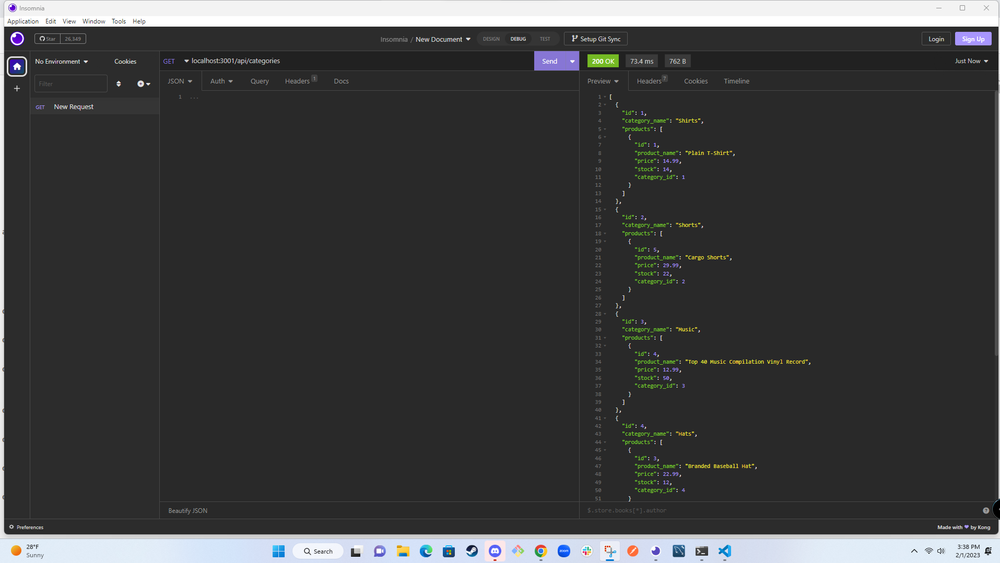

  # Store Database Manager

  ## License
  

  ## Description
  The reason I made this project was to build a backend database using Express.js and Sequelize to run APIs to show, modify, add, and delete data in the database. This is an easier way to build databases and work on them. It is an all in one server and connection point for data. 

  ## Table of Contents
  - [License](#License)
  - [Description](#Description)
  - [Installation](#installation)
  - [Usage](#Usage)
  - [Credits](#credits)
  - [Tests](#Tests)
  - [Questions](#Questions)
  
  ## Installation
  - npm install 
  - npm i --save mysql2 
  - npm i sequelize 
  - npm i dotenv

  ## Usage
  - Walk through video: https://drive.google.com/file/d/11uyp5CquJRx8e1Q9wRRKz5_lVz1ADsBs/view
  
  This project makes it easier for an e-commerce website to maintain its databases. They can perform API get, post, put, and delete calls to adjust whatever needs to fix, added, or deleted all in one place without having to know all the table information. They only need to get the ID of what needs to be done and fix it from an API call. They also only need the category name or product name to add new information to the database.
  
  ## Credits
  Starter code Xandromus

  ## Tests
  I have used API calls in every API route to get, put, post, and delete. 

  ## Questions
  If you would like to ask me any questions. Contact me at my email address below or you can check out my Github profile.
  - Email-kfarshchian@gmail.com
  - Github user name- kfarshchian
  
  
